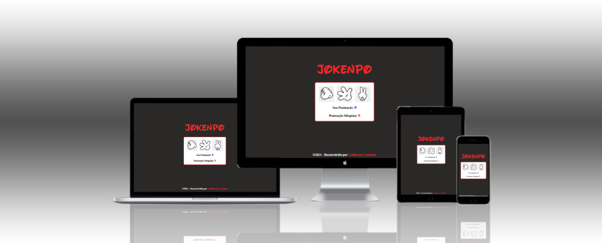

<h1>JOKENPÔ</h1>

## 📝 Sobre

O projeto é um jogo <b>jokenpô</b>, onde você competirá com uma máquina virtual. O projeto está disponível para desktops e dispositivos móveis.

## ⚙ Funcionalidades

Você terá 3 opções, entre elas estão Pedra, Papel e Tesoura, a cada jogada o placar será marcado e a aplicação informará se você perdeu ou ganhou.

## 🖥 Tecnologias

Este projeto foi desenvolvido com HTML, CSS e JavaScript.
